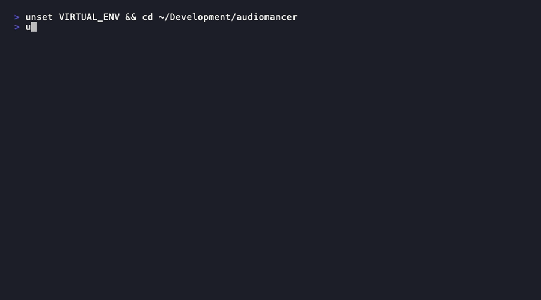

# CLI Commands



## Project Management

### Initialize a New Project

```bash
audiomancer init              # Create new TidalCycles project (interactive)
audiomancer init --path PATH  # Create project at specific path
```

### Check Dependencies

```bash
audiomancer doctor            # Check all dependencies
```


## MCP Server

### Start the Server

```bash
audiomancer serve             # Start MCP server
```

## Sample Library

### Scan and Import

```bash
audiomancer scan ~/Samples    # Scan and import sample folders
```


### Search Samples

```bash
audiomancer search "dark kick" # Search from CLI
```


### Statistics

```bash
audiomancer stats             # Library statistics
```

## Performance

### Run Benchmarks

```bash
audiomancer benchmark         # Run performance benchmarks
```

## Next Steps

- [Workflows](workflows.md) - Example workflows
- [MCP Tools](mcp-tools.md) - MCP tool reference
- [Configuration](../configuration/system.md) - Configure audiomancer
